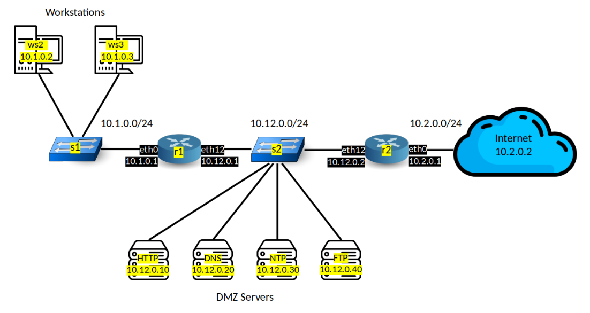

## Table of Contents
- [i. General Setup](#i-general-setup)
- [ii. Organic Enterprise Protections](#ii-organic-enterprise-protections)
- **[1. ARP Cache Poisoning](#1-arp-cache-poisoning)**
  - [1.1 Attack ](#11-attack)
  - [1.2 Protections](#12-protections)
- **[2. Network Scan](#2-network-scan)**
  - [2.1 Attack ](#21-attack)
  - [2.2 Protections](#22-protections)

---

## i. General Setup

```bash
cd $HOME/LINFO2347
git clone git@github.com:nottoBD/mininet-secops.git
chmod u+x mininet-secops/run_deploy 
./mininet-secops/run_deploy 
```
The **run_deploy** script clears and redeploy the complete Mininet environment. If required It will update attack scripts, protection scripts, the network topology file (topo.py).

The script provides the ability to enact protections  once in the Mininet environment. 
```bash
source /home/student-linfo2347/mininet/protections/organic/run_organic_protections.py
 ```

## ii. Organic Enterprise Protections


**ii.1. DMZ Server Restrictions**
* **Implementation:** DMZ hosts (`dmz_organic_protection.nft`) have an `output` chain policy of `drop`, only allowing `established/related` traffic.
* **Effect:**
   * DMZ servers cannot initiate new connections (TCP/UDP/ICMP)
   * Only permit responses to connections initiated by others

**ii.2. Workstation Permissions**
* **Router R1 Rules (`r1_organic_protection.nft`):**
```nftables
iifname "r1-eth0" ip saddr 10.1.0.0/24 ct state new accept  # Allow new outbound
iifname "r1-eth12" ip daddr 10.1.0.0/24 ct state established,related accept  # Allow returns
```
* **Router R2 Rules (`r2_organic_protection.nft`):**
```nftables
iifname "r2-eth12" ip saddr 10.1.0.0/24 ct state new accept  # Workstation→Internet
iifname "r2-eth12" ip saddr 10.12.0.0/24 ip daddr 10.1.0.0/24 ct state established,related accept  # DMZ→WS returns
```
* **Effect:**
   * Workstations can initiate connections to any network
   * Return traffic permitted through both routers

**ii.3. Internet Restrictions**
* **Router R2 Rules (`r1_organic_protection.nft`):**
```nftables
iifname "r2-eth0" ip saddr 10.2.0.0/24 ip daddr 10.12.0.0/24 ct state new accept  # New→DMZ only
iifname "r2-eth0" ip saddr 10.2.0.0/24 ip daddr 10.1.0.0/24 ct state established,related accept  # Returns→WS
```
* **Effect:**
   * Internet hosts can only establish new connections to DMZ (10.12.0.0/24)
   * Workstation-initiated Internet connections are permitted via r2-eth12 rule
   * Bidirectional established traffic allowed

---

## 1. ARP Cache Poisoning
*see walkthrough at: [attacks/arp_cache_poisoning/execution_example.md](attacks/arp_cache_poisoning/execution_example.md)*
### 1.1 Attack
#### Target Selection
- **Focus**: LAN hosts `ws3` (10.1.0.3) and gateway `r1` (10.1.0.1).  
- **Goal**: Intercept traffic between `ws3` and DMZ/internet via MITM.

#### MAC Discovery
- **Method**: Scapy ARP broadcasts to map IP-MAC pairs.  
- **Blocked By**:  
  - Workstation rate limits (8 ARP requests/minute).  
  - Static MAC bindings on `r1`.

#### ARP Spoofing
- **Execution**: Forged replies sent to `ws3` and `r1` (1/second).  
- **Blocked By**:  
  - `r1`’s trusted mappings (fixed IP-MAC pairs).  
  - DMZ rules dropping non-broadcast replies (dest MAC ≠ `ff:ff:ff:ff:ff:ff`).

#### Traffic Interception
- **Success Criteria**: Poisoned ARP caches enable MITM for:  
  - DMZ traffic (HTTP/DNS to 10.12.0.10/20).  
  - Internet traffic via `r2` (10.2.0.1).  
- **Blocked By**:  
  - Workstation gateway MAC validation (00:00:00:00:01:00).  
  - `r2`’s suspicious MAC bans (5 replies/minute).

#### Persistence
- **Method**: Continuous ARP reply flooding.  
- **Mitigation**: Rate limits:  
  - DMZ: 3 replies/minute.  
  - `r1`: 5 replies/minute.  
  - Workstations: 10 replies/minute.  

#### Constraints
- Attacker must reside in LAN (e.g., `ws2`).  
- DMZ servers (10.12.0.10-40) immune due to:  
  - Static router MAC validation (e.g., 10.12.0.1 → `00:00:00:00:01:12`).  
  - `r2`’s impersonation detection (blocks spoofed 10.12.0.2 MACs).
  

### 1.2 Protections
#### DMZ (`dmz_arp_protection.nft`)
- **Static MAC Bindings**:  
  - Enforce 10.12.0.1 → `00:00:00:00:01:12`, 10.12.0.2 → `00:00:00:00:02:12`.  
- **Unsolicited Reply Blocking**: Drop non-broadcast replies.  
- **Rate Limits**:  
  - 5 requests/minute per source.  
  - 3 replies/minute.  

#### Router R1 (`r1_arp_protection.nft`)
- **Trusted Mappings**:  
  - 10.1.0.1 → `00:00:00:00:01:00`, 10.12.0.1 → `00:00:00:00:01:12`.  
- **Rate Limits**: 5 requests/replies per minute.  

#### Router R2 (`r2_arp_protection.nft`)
- **Suspicious Host List**:  
  - 10-minute bans for MACs spoofing 10.12.0.2.  
- **Logging**: Records impersonation attempts.  

#### Workstations (`ws_arp_protection.nft`)
- **Gateway Validation**: Drops replies for 10.1.0.1 with non-`00:00:00:00:01:00` MAC.  
- **Rate Limits**: 10 intra-subnet replies/minute.  


### Residual Risks
- **Manual Maintenance**: Static mappings require updates if MACs change.  
- **Encrypted Traffic**: Protections don’t prevent decryption of intercepted TLS/SSH.  
- **Trusted LAN Attacks**: `ws2` can target `ws3` until rate limits trigger.  

### Efficacy Metrics
- **Blocking**: Poisoning attempts blocked within 1–5 packets.  
- **Detection**: Logs record events (e.g., `R1-ARP-SPOOF`, `R2-IMPERSONATION`).  


---
