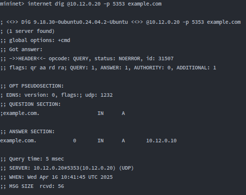

### 2.0 Initial Assessment
```bash
# Verify baseline service status on DMZ servers
http netstat -tulpn | grep -E ':21|:22|:53|:80|:123|:5353'
dns netstat -tulpn | grep -E ':21|:22|:53|:80|:123|:5353'
ntp netstat -tulpn | grep -E ':21|:22|:53|:80|:123|:5353'
ftp netstat -tulpn | grep -E ':21|:22|:53|:80|:123|:5353'
```
```bash
# Test Apache server
internet curl -v http://10.12.0.10
# Test FTP server
internet curl ftp://10.12.0.40/README
# Test NTP server
internet ntpdate -q 10.12.0.30
# Test mDNS server
internet dig @10.12.0.20 -p 5353 example.com
```

### 2.1 Initial Scan (Before Protection)
```bash
# Start packet capture on DMZ switch interface
s2 sudo tcpdump -i s2-eth1 -n -w /tmp/portscan_capture.pcap &

# Run port scan attack
internet python3 mininet/attacks/network_port_scan/main.py

# Check server logs for detection
http tail -n 5 /var/log/apache2/access.log
ftp tail -n 5 /var/log/vsftpd.log
```

### 2.2 Apply Basic Protections
```bash
# Deploy basic organic protections
source mininet/protections/organic/run_organic_protections.py
# Deploy port scan specific protections
source mininet/protections/network_port_scan/run_network_port_scan_protections.py
```

### 2.3 Protection Analysis
```bash
# R2 (Internet-facing router) protection mechanism
# Blacklist-based rate limiting for TCP SYN and UDP
set blacklist {
    type ipv4_addr
    flags timeout
    timeout 1h
}

# Drop packets from blacklisted IPs
ip saddr @blacklist drop

# Add to blacklist if exceeding TCP SYN rate limit
tcp flags & (fin|syn|rst|psh|ack|urg) == syn limit rate over 5/second burst 10 packets add @blacklist { ip saddr timeout 1h }

# Add to blacklist if exceeding UDP rate limit
ip protocol udp limit rate over 5/second burst 1 packets add @blacklist { ip saddr timeout 1h }
```
Testing the attack again will result on Attacker's packet to be dropped.
```bash
# Test protection by running port scan from Internet host
internet python3 mininet/attacks/network_port_scan/main.py
# Result: Scan blocked after initial connections detected
```
Key observations:

- R2 successfully blocks port scan by blacklisting source IP
- Scan terminates after detecting only SSH (22) and HTTP (80) ports on first target
- Defense triggers after exceeding 5 SYN packets/second threshold


### 2.4. Traffic Inspection
```bash
# Examine blacklisted IPs
r2 nft list set inet filter blacklist

# Examine scan counters 
 http sudo nft list counters | grep "scan-counter"
 
# Outside mininet, examine the tcpdump capture
tcpdump -n -r /tmp/portscan_capture.pcap
```
